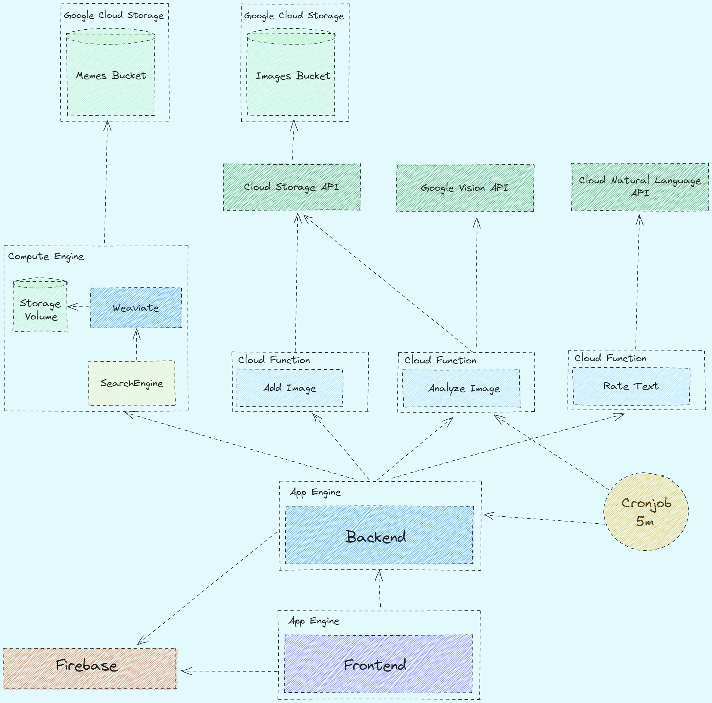

## Business Model

# Project Documentation
## Overview
This documentation provides an overview of the project that utilizes Google Cloud services. The project aims to provide a web interface where users can upload memes with text. The frontend sends the image to the backend, which then sends it to a service that uses Weaviate to search for images without text in a database. Additionally, the backend also sends the image to a Google Function, which stores the image in a bucket. There is also a cron job that initiates an analysis of the images uploaded by a user. User authentication is handled using Firebase. The frontend is built using Redux, while the backend is implemented in Node.js with Express.

The project architecture consists of the following components:

## Architecture

1. **Frontend**: The user interacts with the web interface, where they can upload a meme image with text. The frontend is developed using Redux, a predictable state container for JavaScript apps.

2. **Backend**: The backend handles the requests from the frontend and coordinates the flow of data between different services. It is implemented using Node.js and Express, a web application framework for Node.js.

3. **Image Analysis Service**: This service utilizes Weaviate, an open-source search engine, to search for images without text in a database. The backend sends the uploaded image to this service for analysis.

4. **Google Cloud Function**: A Google Cloud Function is triggered by the backend whenever an image is uploaded. It receives the image from the backend and stores it in a Google Cloud Storage bucket.

5. **Cron Job**: A cron job is scheduled to run periodically and analyze the images uploaded by a user. It performs any required processing or analysis tasks on the images.

6. **User Authentication**: Firebase Authentication is used to handle user authentication and authorization. It provides secure user login and registration functionality.

## Technologies Used

The project utilizes the following technologies:

- Google Cloud: Provides various services, including Google Cloud Storage and Google Cloud Functions, used for image storage and processing.

- Weaviate: An open-source search engine that is used to search for images without text in a database.

- Firebase Authentication: A service provided by Firebase that handles user authentication and authorization.

- Redux: A predictable state container for JavaScript apps, used for managing the frontend state.

- Node.js: A JavaScript runtime environment used for the backend implementation.

- Express: A fast and minimalist web application framework for Node.js, used to build the backend API.
